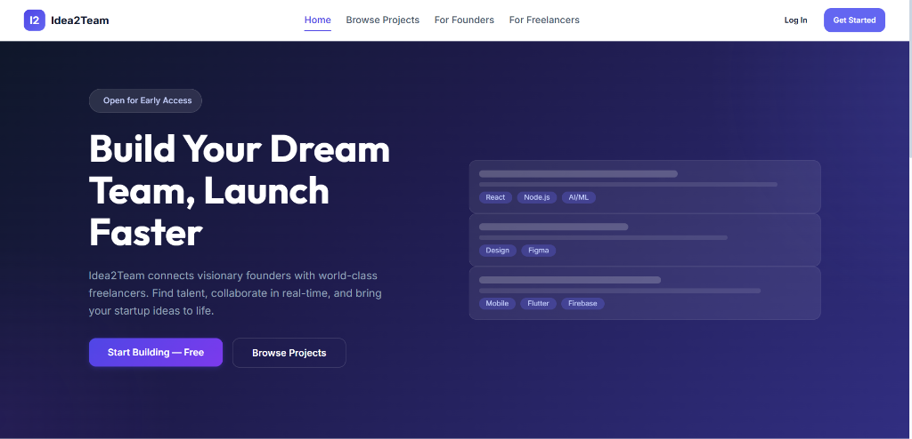
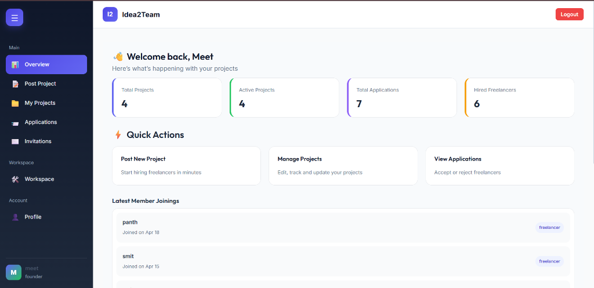
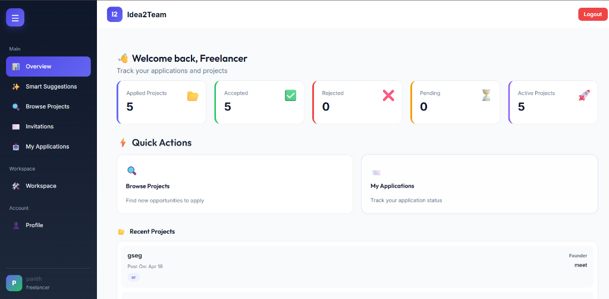
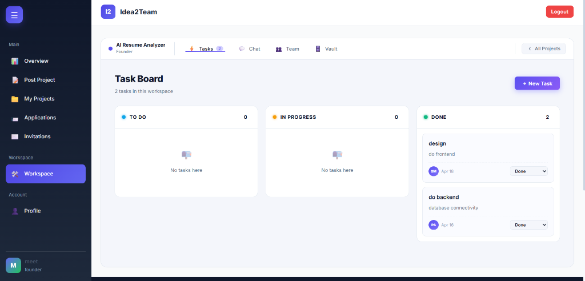

# Idea2Team 🚀

> A full-stack web platform that connects visionary **Founders** with skilled **Freelancers**. Post ideas, discover talent, collaborate in shared workspaces, and build your dream team.

---

## 📋 Table of Contents

- [Overview](#overview)
- [Tech Stack](#tech-stack)
- [Project Structure](#project-structure)
- [Getting Started](#getting-started)
- [Environment Variables](#environment-variables)
- [Database Schema](#database-schema)
- [API Endpoints](#api-endpoints)
- [Routes & Pages](#routes--pages)
- [Features](#features)
- [Screenshots](#screenshots)
- [Contributing](#contributing)

---

## Overview

**Idea2Team** is a three-role platform:

| Role | Description |
|------|-------------|
| 🏗️ **Founder** | Post projects, review freelancer applications, manage teams & workspaces |
| 💼 **Freelancer** | Browse projects, submit proposals, collaborate in real-time workspaces |
| 🛡️ **Admin** | Monitor platform stats, manage users, moderate projects & generate reports |

### Key Features

- 🔐 **Authentication** — Role-based login & registration (Founder / Freelancer)
- 📊 **Dashboards** — Real-time stats, recent activity, and quick actions per role
- 📁 **Project Management** — Post, edit, delete, and toggle project status
- 📨 **Applications** — Submit, review, accept, or reject freelancer applications
- 🤝 **Smart Matching** — AI-style matching between founders and freelancers
- 💬 **Invitations System** — Founders can invite freelancers directly to projects
- 🛠️ **Workspace** — Task board, team members, chat, file vault, and milestones
- 👤 **Profiles** — Editable profile pages for both Founders and Freelancers
- 📂 **File Upload** — Multer-based file upload for project documents

---

## Tech Stack

### Frontend (Client & Admin)

| Technology | Purpose |
|-----------|---------|
| **React.js 19** | UI library |
| **React Router DOM v7** | Client-side routing |
| **Vanilla CSS** | Custom styling with CSS variables, Flexbox & Grid |
| **Lucide React** | Icon library |
| **Axios** | HTTP client for API calls |
| **Socket.io Client** | Real-time communication |
| **Recharts** | Data visualization charts |
| **SweetAlert2** | Styled alert dialogs |

### Backend (Server)

| Technology | Purpose |
|-----------|---------|
| **Node.js + Express.js** | REST API server |
| **MySQL2** | Database driver |
| **Multer** | File upload handling |
| **CORS** | Cross-origin resource sharing |
| **dotenv** | Environment variable management |

### Database

- **MySQL** (local via XAMPP or hosted on Aiven Cloud)

---

## Project Structure

```
idea2team/
│
├── client/                          # User-facing React App (port 3000)
│   └── src/
│       ├── App.js                   # Routes configuration
│       ├── index.js                 # React entry point
│       ├── config/
│       │   └── api.js               # Axios base URL config
│       ├── components/
│       │   ├── cards/               # StatsCard, ProjectCard
│       │   ├── common/              # Avatar, Card, Modal, SearchBar, StatusBadge
│       │   ├── layout/              # Navbar, Footer, Sidebar, Topbar, DashboardLayout
│       │   ├── tables/              # DataTable
│       │   └── workspace/           # WorkspaceApp, ChatBox, ChatPanel, TaskBoard,
│       │                            #   FileUpload, FileVault, Milestones, TeamMembers
│       ├── pages/
│       │   ├── public/              # Home, Login, Register, ForgotPassword
│       │   ├── founder/             # FounderOverview, PostProject, MyProjects,
│       │   │                        #   Applications, EditProject, SmartMatching,
│       │   │                        #   Invitations, FounderWorkspace, FounderProfile
│       │   └── freelancer/          # FreelancerOverview, BrowseProjects, MyApplications,
│       │                            #   ApplyProject, SmartSuggestions, Invitations,
│       │                            #   FreelancerWorkspace, FreelancerProfile
│       └── styles/                  # Modular CSS files (42 files)
│
├── admin/                           # Admin React App (port 3001)
│   └── src/
│       ├── App.js                   # Admin routes
│       ├── components/
│       │   ├── cards/               # StatsCard, ProjectCard
│       │   ├── common/              # Avatar, Button, Card, Modal, SearchBar, StatusBadge
│       │   ├── layout/              # Navbar, Footer, Sidebar, Topbar, DashboardLayout
│       │   └── tables/              # DataTable
│       ├── pages/
│       │   └── admin/               # AdminLogin, AdminOverview, ManageUsers,
│       │                            #   AdminManageProjects, Reports
│       └── styles/                  # Admin CSS files
│
└── server/                          # Express.js Backend (port 1337)
    ├── server.js                    # All API routes
    ├── public/                      # Uploaded files served statically
    ├── idea2team.sql                # Database schema & seed data (gitignored)
    ├── import-db.js                 # Script to import SQL to Aiven cloud (gitignored)
    ├── .env                         # Environment variables (gitignored)
    └── package.json
```

---

## Getting Started

### Prerequisites

- **Node.js** v16+
- **npm** v8+
- **MySQL** (via XAMPP locally, or a hosted MySQL instance)

### 1. Clone the Repository

```bash
git clone https://github.com/your-username/idea2team.git
cd idea2team
```

### 2. Set Up the Database

1. Start MySQL (via XAMPP or your server)
2. Create a database named `idea2team`
3. Import the schema:
   ```bash
   mysql -u root -p idea2team < server/idea2team.sql
   ```

### 3. Configure Environment Variables

Create a `.env` file in the `server/` directory (see [Environment Variables](#environment-variables)).

### 4. Start the Backend Server

```bash
cd server
npm install
npm start
# Server runs on http://localhost:1337
```

### 5. Start the Client App

```bash
cd client
npm install
npm start
# App runs on http://localhost:3000
```

### 6. Start the Admin App

```bash
cd admin
npm install
npm start
# App runs on http://localhost:3001
```

---

## Environment Variables

Create a file at `server/.env`:

```env
DB_HOST=localhost
DB_USER=root
DB_PASSWORD=your_password
DB_NAME=idea2team
DB_PORT=3306
PORT=1337
```

> ⚠️ **Never commit `.env` to version control.** It is already included in `.gitignore`.

---

## Database Schema

### `users`
| Column | Type | Description |
|--------|------|-------------|
| `user_id` | INT (PK) | Auto-increment |
| `full_name` | VARCHAR | User's full name |
| `email` | VARCHAR | Unique email |
| `password` | VARCHAR | Plain text (upgrade to bcrypt for production) |
| `phone` | VARCHAR | Contact number |
| `role` | ENUM | `founder` or `freelancer` |
| `status` | ENUM | `active` or `blocked` |

### `projects`
| Column | Type | Description |
|--------|------|-------------|
| `project_id` | INT (PK) | Auto-increment |
| `founder_id` | INT (FK) | References `users.user_id` |
| `title` | VARCHAR | Project title |
| `description` | TEXT | Detailed description |
| `category` | VARCHAR | Project category |
| `required_skills` | TEXT | Comma-separated skill list |
| `project_stage` | VARCHAR | Idea / MVP / Growth |
| `collaboration_type` | VARCHAR | Remote / Hybrid / On-site |
| `experience_level` | VARCHAR | Junior / Mid / Senior |
| `budget_min` | DECIMAL | Minimum budget |
| `budget_max` | DECIMAL | Maximum budget |
| `duration_weeks` | INT | Estimated duration |
| `team_members_required` | INT | Headcount needed |
| `upload_file` | VARCHAR | Uploaded file path |
| `status` | ENUM | `active` or `closed` |

### `applications`
| Column | Type | Description |
|--------|------|-------------|
| `application_id` | INT (PK) | Auto-increment |
| `project_id` | INT (FK) | References `projects.project_id` |
| `freelancer_id` | INT (FK) | References `users.user_id` |
| `proposal_message` | TEXT | Cover letter / pitch |
| `expected_salary` | DECIMAL | Proposed fee |
| `status` | ENUM | `pending` / `accepted` / `rejected` |
| `applied_at` | TIMESTAMP | Application timestamp |

### `profiles` (Freelancer)
| Column | Type | Description |
|--------|------|-------------|
| `user_id` | INT (PK/FK) | References `users.user_id` |
| `title` | VARCHAR | Professional title |
| `location` | VARCHAR | City / Country |
| `bio` | TEXT | Short bio |
| `skills` | TEXT | Comma-separated skills |
| `experience` | TEXT | Work experience details |
| `github` | VARCHAR | GitHub profile URL |
| `linkedin` | VARCHAR | LinkedIn profile URL |
| `image` | VARCHAR | Profile picture filename |

### `founder_profiles`
| Column | Type | Description |
|--------|------|-------------|
| `user_id` | INT (PK/FK) | References `users.user_id` |
| `phone` | VARCHAR | Contact number |
| `location` | VARCHAR | City / Country |
| `bio` | TEXT | Founder bio |
| `company_name` | VARCHAR | Company / startup name |
| `company_website` | VARCHAR | Company URL |
| `industry` | VARCHAR | Industry sector |
| `company_size` | VARCHAR | Team size range |
| `company_description` | TEXT | Company overview |
| `image` | VARCHAR | Profile picture filename |

---

## API Endpoints

Base URL: `http://localhost:1337`

### 🔐 Authentication

| Method | Endpoint | Description |
|--------|----------|-------------|
| `POST` | `/api/register` | Register new user (founder/freelancer) |
| `POST` | `/api/login` | Login and return user session data |
| `POST` | `/api/forgot-password` | Simulate password reset email |
| `POST` | `/api/admin-login` | Admin authentication |

### 👥 Users

| Method | Endpoint | Description |
|--------|----------|-------------|
| `GET` | `/api/userinfo/:id` | Get user details by ID |
| `GET` | `/api/admininfo/:id` | Get admin details by ID |
| `GET` | `/api/Manage-Users` | Get all users (admin) |
| `PUT` | `/api/block-user/:id` | Toggle user active/blocked status |

### 📁 Projects

| Method | Endpoint | Description |
|--------|----------|-------------|
| `POST` | `/api/post-project` | Create a new project (with file upload) |
| `GET` | `/api/projects` | Get all active projects (with founder name) |
| `GET` | `/api/myProject/:id` | Get all projects by a specific founder |
| `GET` | `/api/editproject/:id` | Get single project for editing |
| `GET` | `/api/info-projects/:id` | Get single project details |
| `GET` | `/api/manage-project` | Get all projects (admin) |
| `PUT` | `/api/founder/edit-project/:id` | Update project details |
| `PUT` | `/api/status-project/:id` | Toggle project active/closed status |
| `DELETE` | `/api/project/:id` | Delete a project |

### 📨 Applications

| Method | Endpoint | Description |
|--------|----------|-------------|
| `POST` | `/api/apply-project` | Submit a new application |
| `GET` | `/api/info-application/:id` | Get applications for a founder's projects |
| `GET` | `/api/freelancer/myapplication/:id` | Get all applications by a freelancer |
| `PUT` | `/api/application/accept/:id` | Accept an application |
| `PUT` | `/api/application/reject/:id` | Reject an application |

### 👤 Profiles

| Method | Endpoint | Description |
|--------|----------|-------------|
| `POST` | `/api/profile` | Create/upsert freelancer profile |
| `GET` | `/api/profile/:user_id` | Get freelancer profile |
| `PUT` | `/api/profile/:user_id` | Update freelancer profile |
| `POST` | `/api/founder-profile` | Create/upsert founder profile |
| `GET` | `/api/founder-profile/:user_id` | Get founder profile |

### 📊 Dashboard Stats

| Method | Endpoint | Description |
|--------|----------|-------------|
| `GET` | `/api/founder/dashboard/:id` | Founder dashboard stats |
| `GET` | `/api/freelancer/dashboard/:id` | Freelancer dashboard stats |
| `GET` | `/api/admin/stats` | Platform-wide admin stats |
| `GET` | `/api/admin/recent-activity` | Recent projects and users |
| `GET` | `/api/founder/dashboard/recent-freelancer/:id` | Recent applicants for founder |
| `GET` | `/api/freelancer/dashboard/recent-project/:id` | Recent projects for freelancer |

---

## Routes & Pages

### Client App (`localhost:3000`)

**Public**
| Route | Page |
|-------|------|
| `/` | Home / Landing Page |
| `/login` | Login |
| `/register` | Register |

**Founder Dashboard**
| Route | Page |
|-------|------|
| `/founder/dashboard` | Overview & Stats |
| `/founder/post-project` | Post a New Project |
| `/founder/projects` | My Projects |
| `/founder/applications` | Review Applications |
| `/founder/edit-project/:id` | Edit Project |
| `/founder/smart-matching/:id` | AI Smart Matching |
| `/founder/invitations` | Invitations Sent |
| `/founder/workspace` | Project Workspace |
| `/founder/profile` | Founder Profile |

**Freelancer Dashboard**
| Route | Page |
|-------|------|
| `/freelancer/dashboard` | Overview & Stats |
| `/freelancer/browse` | Browse Projects |
| `/freelancer/applications` | My Applications |
| `/apply-project/:id` | Apply to a Project |
| `/freelancer/suggestions` | Smart Suggestions |
| `/freelancer/invitations` | Invitations Received |
| `/freelancer/workspace` | Project Workspace |
| `/freelancer/profile` | Freelancer Profile |
| `/freelancer/profile/:id` | View Freelancer Profile |

### Admin App (`localhost:3001`)

| Route | Page |
|-------|------|
| `/` or `/login` | Admin Login |
| `/dashboard` | Admin Overview |
| `/users` | Manage Users |
| `/projects` | Manage Projects |
| `/reports` | Reports & Analytics |

---

## Features

### Workspace
The shared project workspace includes:
- **Task Board** — Kanban-style To-do / In Progress / Done columns
- **Team Members** — Live team member list with roles
- **Chat Box** — Real-time messaging via Socket.io
- **File Vault** — Upload and browse project files
- **Milestones** — Timeline view of project milestones

### Smart Matching
Founders can trigger AI-style matching (`/founder/smart-matching/:id`) which suggests the best freelancer candidates based on required project skills.

### Invitations
- Founders can invite freelancers directly to their projects
- Freelancers see received invitations on their dashboard

---

## Screenshots

### Landing Page


### Founder Dashboard


### Freelancer Dashboard


### Project Workspace (Task Board)


---

## Contributing

This project was built as an internship capstone project. It is not currently open for public contributions.

---

## License

This project is for educational and demonstration purposes only.

---

*Built with ❤️ as an internship project — 2026*
